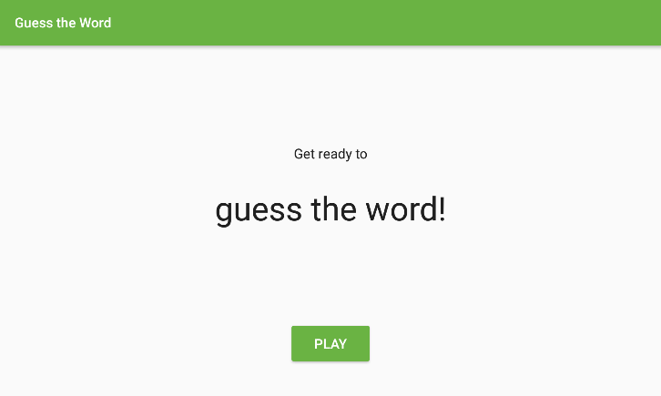
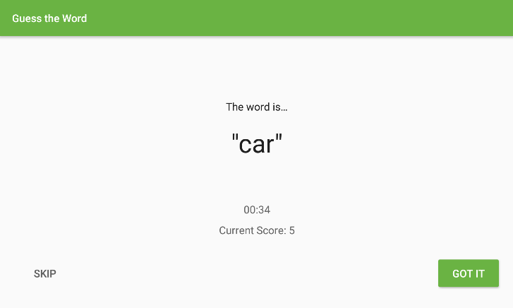
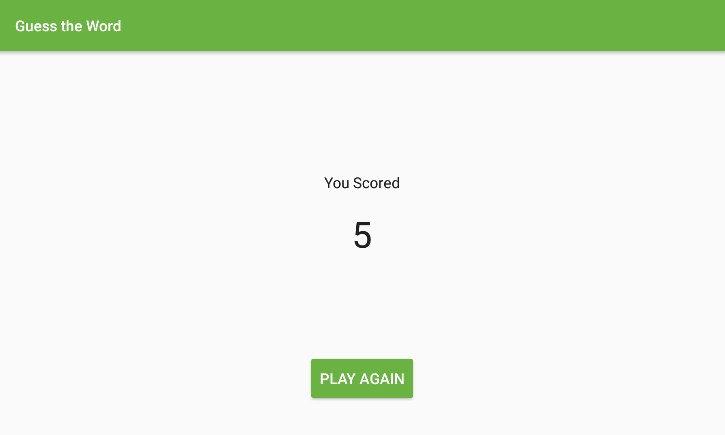

# Guess It!
Guess It is a word guessing app you can play with one or more friends. To play, hold the device in landscape, facing away from you with your thumbs on the Skip and Got It buttons. Your friends can then give you clues to help you guess the word.

If you get the word right, press Got It. If you're stuck, press Skip. The game runs for a minute and then shows you your score.

## What I Did
- Adding ViewModel
- Adding LiveData
- Adding Countdown Timer
- Use Data Binding in the Layout xml code to communicate directly with the ViewModel
- Use  LiveData to auto update Layout via Data Binding
- Use a Tranformations.map to convert the Current Time into a Formatted String
- Adding Sounds
- Make app open in full screen

### Screenshots
 

